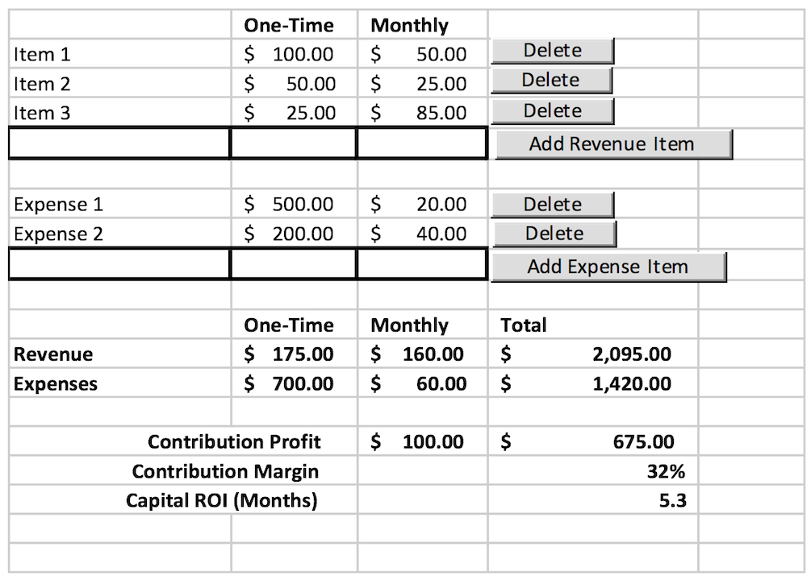

# Developer Interview Exercise
#### Zayo Labs
###

### ROI Calculator

This application is a ROI Calculator built with React. A ROI (Return of Investment) calculator is an investment calculator that allows you to estimate profit and loss of investments and is particularly helpful when making financial decisions.

**Your goal: Modernize the application. Refactor App.js into reusable components. Utilize ES6+ features. There is no right way to "refactor" the app. Creativity is welcomed.**

The app was built to mimic the functionality of the spreadsheet below.



All of the bold fields are calculated fields and should not be editable.  As additional revenue and expense items are added, the calculated fields should update automatically on the page.  As items are deleted, the calculated fields should also update automatically on the page.

All fields should be formatted correctly: currency format, percentage format (for the Contribution Margin), and decimal format (for the Capital ROI).

The following formulas are used in the app to calculate financials:
- One-Time Revenue = Sum of the one-time column of all revenue items
- Monthly Revenue = Sum of the monthly column of all revenue items
- One-Time Expense = Sum of the one-time column of all expense items
- Monthly Expense = Sum of the monthly column of all expense items
- Total Revenue = One-Time Revenue + Monthly Revenue * 12
- Total Expenses = One-Time Expense + Monthly Expenses * 12
- Monthly Contribution Profit = Monthly Revenue – Monthly Expenses
- Total Contribution Profit = Total Revenue – Total Expenses
- Contribution Margin = Total Contribution Profit / Total Revenue
- Capital ROI (Months) = (One-Time Expenses – One-Time Revenue) / Monthly Contribution Profit

To get started:
```
// Fork and clone the repo

$ cd developer-exercise/
$ yarn                       // to install dependencies
$ yarn start                 // to start the server
```

**Once you have completed the exercise, submit a PR with the base fork as zayo-labs/developer-exercise master.**

Feel free to reach out with any questions.